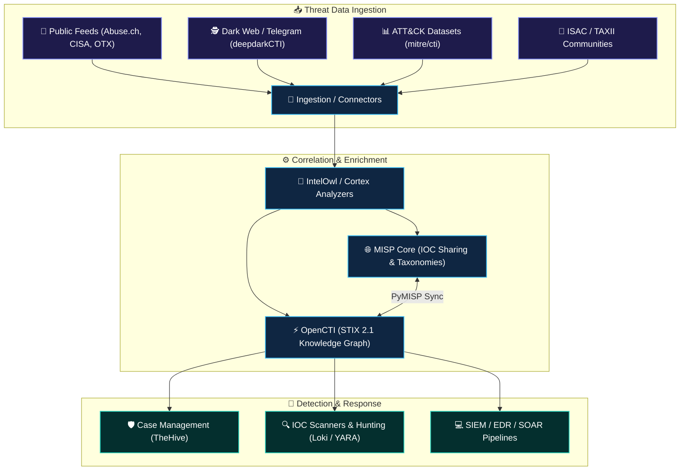

# 🛡️ Awesome Threat Intelligence Management (TIM)

### 🌐 Curated List of Cyber Threat Intelligence Platforms, Frameworks, SaaS Solutions & Open-Source Tools

      

 

**A comprehensive, SEO-optimized knowledge base covering Cyber Threat Intelligence (CTI), Threat Intelligence Platforms (TIP), STIX 2.1 / TAXII standards, IOC & TTP correlation, knowledge graphs, and automated SecOps enrichment.**

---

## 📖 Overview

Threat Intelligence Management (TIM) systems collect, normalize, correlate, enrich, score, and operationalize cyber threat data — spanning technical Indicators of Compromise (IOCs), adversary Tactics, Techniques, and Procedures (TTPs), threat actor profiling, malware campaigns, vulnerability intelligence, and strategic geopolitical context.

Security Operations Centers (SOCs), Cyber Threat Intelligence (CTI) units, Detection Engineering, and Incident Response (IR) teams rely on these platforms to accelerate detection triage, proactively hunt adversaries, and orchestrate rapid response workflows across SIEM, EDR, and SOAR ecosystems.

---

## 📑 Table of Contents

- [🏢 SaaS & Hosted Commercial Platforms](#-saas--hosted-commercial-platforms)
  - [📊 Market Size & Sector Dynamics](#-market-size--sector-dynamics)
  - [📋 SaaS Comparison Table](#-saas-comparison-table)
- [🔓 Open-Source GitHub Projects](#-open-source-github-projects)
  - [⭐ Open-Source Solutions (Ranked by Stars)](#-open-source-solutions-ranked-by-stars)
  - [🏗️ Architectural Frameworks for Self-Hosted TIPs](#️-architectural-frameworks-for-self-hosted-tips)
- [🤝 How to Contribute](#-how-to-contribute)
- [📈 Star History](#-star-history)
- [⚠️ Disclaimer](#️-disclaimer)

---

## 🏢 SaaS & Hosted Commercial Platforms

### 📊 Market Size & Sector Dynamics

> 💡 **Market Overview:** The global Cyber Threat Intelligence (CTI) and Threat Intelligence Platform (TIP) market is estimated at **$5.5 Billion to $6.2 Billion in 2025/2026** and is projected to surpass **$11.8 Billion by 2030**, reflecting a compound annual growth rate (**CAGR of ~15.4%**). 
>
> 🔍 **Industry Concentration:** The sector is **moderately to highly fragmented** rather than concentrated or "winner-take-all". Because enterprise threat landscapes encompass specialized functional domains — such as STIX/TAXII threat graph correlation, deep/dark web intelligence, external attack surface management (EASM), and automated SOAR orchestration — vendors maintain differentiated positions rather than a single player dominating the entire market.

---

### 📋 SaaS Comparison Table

*The table below compares category-leading SaaS/Commercial TIPs, sorted in **descending order by company scale (valuation / annual recurring revenue / corporate backing)**:*

| 🏢 Platform / Product | 📊 Company Scale (Valuation / Revenue) | 🎯 Description / Core Capabilities | 💰 Starting Price (Pricing) | 🎁 Free Tier / Free Trial Limits |
| :--- | :--- | :--- | :--- | :--- |
| **[Recorded Future](https://www.recordedfuture.com/)** | **$2.65 Billion Valuation** (Acquired by Mastercard in 2024; >$300M ARR, 1,900+ enterprise clients) | Leading intelligence cloud that continuously collects open, dark-web, and technical telemetry to deliver real-time risk scores and threat graph analytics. | Starts at ~$50,000/year (base core module/license; typical enterprise contracts range $50,000–$250,000+/year based on modules: SecOps, Brand, Vuln, Attack Surface) | No free-forever tier for full platform (free standalone browser extension and malware sandbox tools available); offers a **30-day free trial** for specific ecosystem integrations (e.g., Microsoft Sentinel) and guided 14-to-30-day evaluation PoC |
| **[Cyware](https://www.cyware.com/)** (CTIX) | **~$400M–$450M Valuation** (Series C funded, $70M+ total capital raised; ~$35M–$50M ARR) | Cyber Threat Intelligence Exchange platform emphasizing automated ingestion, enrichment, bidirectional hub-and-spoke sharing, and SecOps orchestration. | Starts at ~$35,000/year (CTIX Lite / entry deployment; full enterprise multi-hub deployments scale $50,000–$150,000+/year) | No free-forever tier; offers a 14-to-30-day private Proof of Concept (PoC) trial via sales / AWS Marketplace Private Offer for scoped hub testing and integration validation |
| **[Anomali](https://www.anomali.com/)** (ThreatStream) | **~$300M–$350M Valuation** (Series E funded, $96M+ capital raised from GV, IVP; ~$50M–$70M ARR) | Enterprise TIP focused on high-volume IOC management, automated multi-feed ingestion, confidence scoring, and SIEM/EDR/SOAR integration. | Starts at ~$50,000/year (mid-market entry tier; average enterprise contracts ~$93,000/year; scaling to $250,000–$500,000/year for global deployments) | No free-forever tier (legacy STAXX tool discontinued); provides a 30-day guided sales-assisted evaluation / PoC environment with limited test feed ingestion |
| **[ThreatConnect](https://threatconnect.com/)** | **~$200M–$250M Valuation** (Growth Equity backed by Providence Strategic Growth; ~$40M–$60M ARR) | Threat intelligence platform with analyst workflows, intelligence lifecycle management, confidence scoring, and native SOAR automation. | Starts at ~$60,000/year (mid-market entry tier; typical enterprise range $60,000–$200,000+/year based on user seats, data volume, and SOAR/RQ modules) | No free-forever tier; offers a 30-day guided Proof of Concept (PoC) / evaluation sandbox upon sales qualification (scoped to test feeds and evaluation environment) |
| **[OpenCTI Enterprise](https://filigran.io/)** (Filigran Cloud) | **~$150M–$200M Valuation** (Series B $35M round led by Insight Partners in 2024, $50M+ total raised; ~$15M–$25M ARR) | Commercial enterprise and managed SaaS edition of OpenCTI, adding automated playbooks, AI-assisted reporting, RBAC, and dedicated cloud hosting. | Starts at ~$12,000/year (~€10,000–€15,000/year for dedicated Cloud Standard / Medium instance; scales with compute/cluster resources) | **Community Edition** is 100% free forever (open-source Apache 2.0, self-hosted, full STIX 2.1 model); **Filigran Cloud Enterprise** offers a **30-day free trial** with access to all enterprise features, playbooks, and AI modules |
| **[EclecticIQ](https://www.eclecticiq.com/)** (Intelligence Center) | **~$120M–$150M Valuation** (Series C funded, €45M+ capital raised; ~$15M–$25M ARR) | Intelligence-driven security platform and TIP built on STIX/TAXII standards, featuring analyst workbench tools and graph correlation. | Starts at ~$45,000/year (base tier for core Intelligence Center; enterprise packages range $60,000–$180,000+/year based on analyst seats and feed connectors) | No free-forever tier; offers time-limited 30-day integration "TIP Bundles" / evaluation trials for specific vendor integrations to validate operational impact |
| **[ThreatQuotient](https://threatq.com/)** (ThreatQ) | **~$100M–$120M Valuation** (Acquired by Securonix in 2025; ~$20M–$30M ARR) | Threat intelligence platform centered on Threat Data Integrity, customizable prioritization scoring, and security operations workflow integration. | Starts at ~$40,000/year (base deployment tier; typical enterprise deployments scale $50,000–$150,000+/year based on analyst seats and connector volume) | No free-forever tier; provides a 30-day structured Proof of Concept (PoC) / sandbox evaluation through sales engineering and partner channels (e.g., Carahsoft) |
| **[Silent Push](https://www.silentpush.com/)** | **~$40M–$60M Valuation** (Series A funded, $10M+ raised led by Ten Eleven Ventures; ~$5M–$10M ARR) | Threat intelligence platform specializing in global DNS/infrastructure analysis, domain reputation, and early adversary infrastructure detection. | Starts at ~$1,200/year ($100/month for Starter tier; Professional/Enterprise tiers scale $4,800–$25,000+/year based on query volume and API feeds) | **Free Community Edition** (free forever for non-production/eval use) limited to **1 user seat** and **250 query requests per month**; also offers a 14-day full-feature trial for Pro evaluation |
| **[SOCRadar](https://socradar.io/)** | **~$30M–$50M Valuation** (Series A / High-growth model, $5M+ raised; ~$8M–$15M ARR) | Extended Threat Intelligence (XTI) platform combining cyber threat intelligence, digital risk protection, and external attack surface management. | Starts at $4,550/year (Advanced Dark Web module; comprehensive CTI & attack surface packages range $7,900–$11,950+/year) | **SOCRadar Free Edition** free for 12 months (1 year) with limits: 1 monitored corporate domain, up to 100 auto-discovered digital assets, basic dark web / exposed credential alerts, and critical zero-day vulnerability notifications |
| **[MISP Professional / Commercial Support](https://www.misp-project.org/)** | **~$5M–$10M Ecosystem Volume** (Global commercial support partner network & CIRCL Foundation) | Commercial support contracts, SLA services, and dedicated managed cloud hosting built around the open-source MISP platform by MISP Project / CIRCL & partners. | Starts at ~€6,000/year (~$6,500/year for single-instance managed hosting and standard SLA support tier; enterprise multi-instance support €15,000–€35,000+/year) | MISP core is 100% free forever (AGPLv3 open-source, self-hosted, unlimited events/attributes/users); commercial hosting partners offer 14-day evaluation demo instances upon request |

---

## 🔓 Open-Source GitHub Projects

The open-source threat intelligence ecosystem provides battle-tested platforms, parsers, enrichment microservices, and standardized data models.

### ⭐ Open-Source Solutions (Ranked by Stars)

*All repositories are sorted in **descending order by GitHub star count** (live badges link directly to repo stargazers):*

1. **[OpenCTI](https://github.com/OpenCTI-Platform/opencti)**   
   ⚡ Leading open-source Cyber Threat Intelligence platform built strictly on STIX 2.1. Structures, stores, visualizes, and connects technical and non-technical threat knowledge via GraphQL API, hypergraph visualizations, and automated connectors.

2. **[deepdarkCTI](https://github.com/fastfire/deepdarkCTI)**   
   🕵️ Curated collection and intelligence index of deep web, dark web, ransomware leak portals, Telegram monitoring channels, and adversary tracking sources for CTI analysts.

3. **[MISP (Malware Information Sharing Platform)](https://github.com/MISP/MISP)**   
   🌐 The global standard open-source threat intelligence and sharing platform. Built for collecting, storing, correlating, and exchanging indicators, financial fraud telemetry, and threat events across trusted ISACs and CERT communities.

4. **[IntelOwl](https://github.com/intelowlproject/IntelOwl)**   
   🦉 Scalable Threat Intelligence orchestration engine designed to triage, enrich, and analyze observables (IPs, domains, hashes, URLs) across 100+ public and commercial threat intel APIs simultaneously.

5. **[TheHive](https://github.com/TheHive-Project/TheHive)**   
   🛡️ Security Incident Response and collaborative case management platform closely integrated with TIPs (MISP, OpenCTI) for observable triage and incident tracking.

6. **[Loki IOC Scanner](https://github.com/Neo23x0/Loki)**   
   🔍 Simple, fast, and IOC scanner based on YARA rules, filenames, hashes, and C2 indicators generated from threat intelligence feeds.

7. **[MITRE ATT&CK CTI Datasets](https://github.com/mitre/cti)**   
   📊 Foundational repository containing the official MITRE ATT&CK®, CAPEC™, and ATLAS™ datasets expressed natively in STIX 2.0/2.1 JSON representations.

8. **[Yeti](https://github.com/yeti-platform/yeti)**   
   🗂️ Open-source platform organizing observables, indicators, and TTPs in an analyst-friendly workbench with automated feeds and graph-based relationships.

9. **[Cortex](https://github.com/TheHive-Project/Cortex)**   
   ⚙️ Observable analysis and active response engine. Enables execution of automated analyzer scripts and responders for threat observables.

10. **[AIL Framework](https://github.com/CIRCL/AIL-framework)**   
    🔍 Modular framework for analyzing information leaks, tracking unstructured paste sites, Tor hidden services, and extracting threat intelligence indicators.

11. **[OpenCTI Connectors](https://github.com/OpenCTI-Platform/connectors)**   
    🔌 Official and community connectors that ingest, enrich, and export intelligence between OpenCTI and dozens of data feeds (MISP, AlienVault OTX, VirusTotal, SIEMs).

12. **[PyMISP](https://github.com/MISP/PyMISP)**   
    🐍 Python library providing full programmatic access to MISP REST APIs for querying, creating events, managing attributes, and automating synchronization.

13. **[OASIS CTI STIX 2 Python APIs](https://github.com/oasis-open/cti-python-stix2)**   
    📦 Official OASIS Open Python library for creating, parsing, validating, and manipulating STIX 2.0 and STIX 2.1 Cyber Threat Intelligence objects.

14. **[OTX Python SDK](https://github.com/AlienVault-OTX/OTX-Python-SDK)**   
    📡 Official Python SDK for AlienVault Open Threat Exchange (OTX), allowing automated querying and ingestion of pulses, indicators, and threat feeds.

15. **[MWDB Core](https://github.com/CERT-Polska/mwdb-core)**   
    🦠 Malware sample and static configuration management repository developed by CERT Polska with REST API and automated pipeline integration.

16. **[MISP Modules](https://github.com/MISP/misp-modules)**   
    🧩 Expansion services, enrichment modules, import, and export handlers for MISP and compatible threat intelligence systems.

17. **[OpenCTI Python Client](https://github.com/OpenCTI-Platform/client-python)**   
    💻 Official Python client library to interface directly with OpenCTI instances, GraphQL endpoints, and real-time streaming data queues.

18. **[Cabby](https://github.com/EclecticIQ/cabby)**   
    🚀 Lightweight Python library and CLI tool providing a TAXII client implementation for discovering and polling TAXII 1.0/1.1 collections.

---

### 🏗️ Architectural Frameworks for Self-Hosted TIPs

---

## 🤝 How to Contribute

1. 🍴 **Fork the repository** on GitHub.
2. 🌿 **Create a new branch**: `git checkout -b add-threat-intel-tool`.
3. 📝 **Add your entry** following the tabular or bulleted format with verified pricing/star badges.
4. 🚀 **Commit and push** your changes.
5. 📬 **Submit a Pull Request** with a brief summary of the proposed additions.

---

## 📈 Star History

---

## ⚠️ Disclaimer

- This is a **community-curated index** for informational and educational purposes — not an endorsement of any vendor or platform.
- Threat intelligence platforms process sensitive security telemetry and influence detection/triage actions. Always enforce proper data access controls, TLP (Traffic Light Protocol) markings, and legal sharing guidelines when operationalizing threat data.

---

⭐ **Found this resource valuable? Star the repository to support continuous updates!** ⭐

[Explore More Awesome Lists](https://github.com/ishandutta2007/Awesome-Awesome-Awesome)

